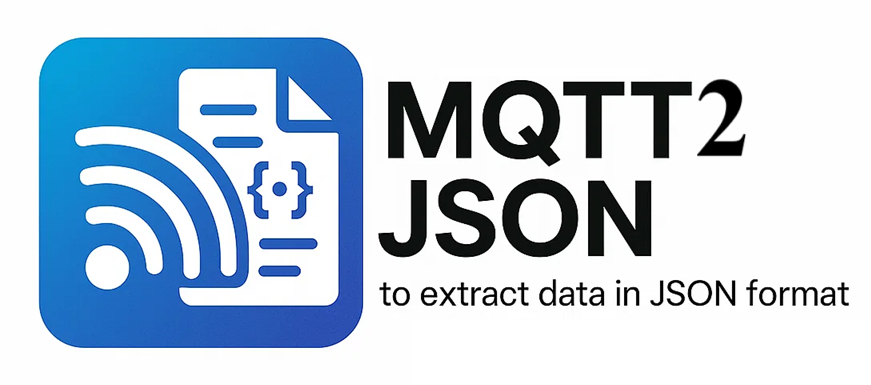

# MQTT2JSON

This project subscribes to MQTT topics and logs all received messages
into structured files (CSV and JSON). It is designed to run easily
inside Docker and integrates seamlessly with ChirpStack.

By default, it subscribes to ChirpStack application and gateway topics,
decodes LoRaWAN frames, extracts metadata such as MType, DevEUI,
DevAddr, and automatically generates time-window summaries.

  -------------------------
  1. Clone the Repository
  -------------------------

git clone https://github.com/FOLLOWME-prj/mqtt2json.git 

cd mqtt2json

  ------------------
  2. Prerequisites
  ------------------

-   A running MQTT Broker (for example from ChirpStack)
-   Docker
-   Docker Compose

  -----------------------------------------------------------
  3. Configure ChirpStack Gateway Bridge (JSON or Protobuf)
  -----------------------------------------------------------

Option A: Use JSON Encoding (Simpler)

sudo nano /etc/chirpstack-gateway-bridge/chirpstack-gateway-bridge.toml

Change: marshaler=“protobuf”

To: marshaler=“json”

Restart: sudo systemctl restart chirpstack-gateway-bridge

Option B: Use Protobuf Encoding (Recommended) No changes required. This
project supports protobuf decoding.

  --------------------------
  4. Configure MQTT Topics
  --------------------------

topics.txt default content:

application/# gateway/#

  ------------------------------
  5. Configure Docker Settings
  ------------------------------

nano docker-compose.yml

Modify:

MQTT_BROKER: “172.17.73.34” MQTT_PORT: “1883” MQTT_USERNAME: “”
MQTT_PASSWORD: “” WINDOW_SECONDS: “55”

  ------------------------------
  6. Build and Run the Project
  ------------------------------

sudo docker compose build sudo docker compose up

To stop:

sudo docker compose down

  -----------------------------------------
  7. Output Files (Saved in Data/ Folder)
  -----------------------------------------

1.  Raw CSV of MQTT messages
2.  Window summary CSV
3.  JSONL file (one JSON object per line)

  ---------------------
  8. Features Summary
  ---------------------

-   MQTT live subscription
-   ChirpStack integration
-   Protobuf & JSON decoding
-   LoRaWAN MType decoding
-   CSV + JSONL logging
-   Time-window aggregation
-   Fully Dockerized
-   Window configurable via Docker

